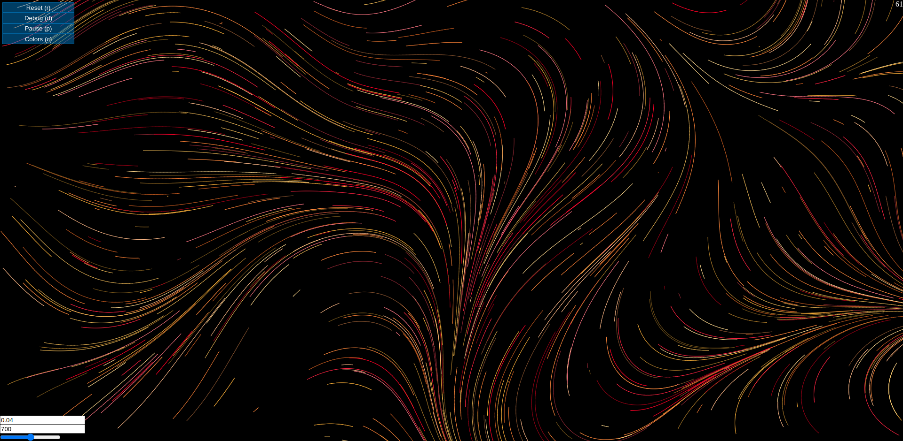

# Flow Field using JS

My implementation of a Flow Field. I am leveraging the Perlin Noise to achieve smooth movement generation, using only Javascript.  
A minimalist UI allows to change the presets and achieve different results.